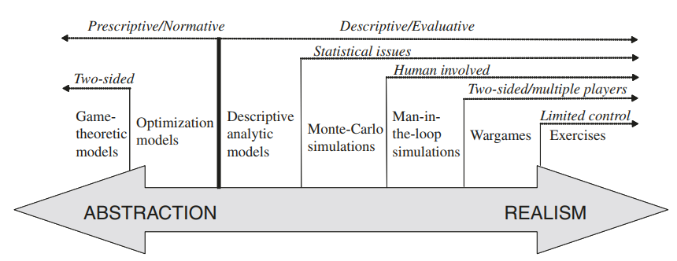

# Introdução

Um modelo é uma abstração da realidade. A necessidade de modelos decorre do fato de que o mundo real é muito complicado para nós raciocinarmos sobre ele e contém muitos detalhes que não são necessariamente relevantes. Nossas capacidades intelectuais limitadas nos permitem lidar apenas com abstrações que retêm a essência do assunto sem os detalhes que distraem. Modelos são usados para raciocínio, percepção, planejamento e previsão. Eles precisam capturar os fatores-chave do objeto ou situação e representá-los fielmente para que os modelos possam ser utilizados de forma eficaz.
- **Validação**: Avaliar o grau de concordância do modelo com o mundo real.
- **Verificação**: Avaliar se uma implementação específica de um modelo está correta no sentido de ser fiel ao modelo. 
- **Modelo deterministico**: Modelo que afirma exatamente o que vai acontecer, como se não houvesse incerteza.
- **Modelo estocástico**: Modelo que assume dados incertos ou probabilísticos,
requisitando a terminologia da teoria da probabilidade.
- **Simulação**: um método específico de implementação de modelos estocásticos que gera uma sequência de replicações de um experimento abstrato. Ex.: Simulação de Monte Carlo.
- **Modelos analíticos**: Ao contrário das simulações, não dependem de múltiplas replicações. Composto por fórmulas que descrevem os resultados de forma concisa. Os modelos analíticos podem ou não ser estocásticos.
- **Modelos normativos (ou prescritivos)**: Visam explicitamente encontrar decisões ótimas, isto é, visam prescrever cursos de ação ideais em situações de combate complexas, exigindo então maior abstração.
- **Modelos descritivos (ou avaliativos)**: Visam descrever fenômenos e processos de combate sem prescrever cursos de ação, podendo assim ser menos abstratos.
- **Modelos de otimização**: lidam com apenas um único tomador de decisão, buscando uma decisão que seja de alguma forma “ótima”.
- **Modelos de teoria dos jogos**: semelhante aos modelos de otimização, mas lidam com múltiplos tomadores de decisão.
- **Jogos de guerra**: são um tipo de simulação que também envolve múltiplos tomadores de decisão, porém usando humanos em um esforço para alcançar o realismo.

Podemos ver então que da abstração pro realismo, primeiro temos o grande grupo de modelos normativos que são os mais abstratos por buscar presrever os cursos de ação ideais. Avançando sempre da anstração pro realismo,  como um modelo que modele os dois lados de uma disputa é mais abstrato que um modelo que modele apenas um lado em resposta a um evento determinado do outro., primeiro lidamos com modelos que modelam a ação ótima em um jogo com dois jogadores (teoria dos jogos) e então modelos com apenas de um jogador (otimização). 

Começamos então a lidar com modelos descritivos, isto é, que visam apenas descrever os fenômenos. O mais abstrato são modelos analíticos, seam determinísticos ou estocásticos, estes modelos visam descrever situações através de equações e possuem uma solução analítica exata. Conforme avançamos no realismo, precisamos deixar de vez o determinismo de lado, e entrarmos de vez nas simulações. Daqui em diante a verificação é mais difícil pela natureza estatística da simulação, diferentemente dos casos anteriores, como simulações dependem de geradores de números aleatórios, característica ausente nos modelos anteriores, duas implementações diferentes, ainda que corretas, podem ter dois resultados diferentes.

As duas primeiras simulações são de Monte-Carlo e Homem-no-loop nesta ordem, uma vez que a segunda se diferencia da primeira ao exigir participação humana, característica que todos próximos modelos compartilham. Temos então os wargames que inaguram o envolvimento de humanos em mais de um lado, e por fim os exercícios. A diferença crucial deste último é que ele é pelo menos em parte afetado pelo mundo real, e por isso, alguns dos seus aspectos não são cotroláveis.
